# AI Recruitment Assistant
### CCZG506 — Assignment II: API-driven Cloud Native Solution

**Domain:** HR / Recruitment
**Categories:** Computer Vision + Natural Language Processing
**Unified objective:** screen one candidate against one job description

---

## 1. Group details

Individual submission — single-member group.

| Sl. | BITS ID | Name | Contribution | % |
|---|---|---|---|---|
| 1 | 2024AC05266 | Aastha Sakshi | All work: CV and NLP sub-tasks, JD-guided selection, DistilBERT fine-tuning, the three-arm evaluation harness, LLMOps instrumentation, API, UI and containerisation. | 100 |

---

## 2. Problem statement and objective

A recruiter opening a role receives hundreds of resumes in mixed formats: text
PDFs exported from Word, scans of printed documents, phone photographs, DOCX
files. Each has to be judged against one job description, consistently, and the
judgement has to be defensible afterwards. Done manually this is slow, and the
consistency degrades over a long screening session.

**Objective.** A single API-driven service that ingests a resume in any of those
formats, confirms it is actually a resume, reads it, extracts structured facts,
scores fit against a job description, answers follow-up questions with literal
evidence from the document, and drafts a screening brief.

**Categories chosen: Computer Vision and NLP.** The third available category,
Speech Recognition, was deliberately not selected. No part of resume screening
involves audio, and bolting on a speech sub-task would have violated
requirement 5 — the sub-tasks must serve one cohesive objective, not be a
checklist of unrelated demos.

---

## 3. Sub-tasks and models (requirements 3 and 4)

Six sub-tasks, against a minimum of five.

| # | Sub-task | Category | Model | Endpoint |
|---|---|---|---|---|
| 1 | Document-type image classification | CV | `microsoft/dit-base-finetuned-rvlcdip` | `POST /classify-document` |
| 2 | Text extraction / OCR | CV | PyMuPDF + docTR (`db_resnet50` + `crnn_vgg16_bn`) | `POST /extract-text` |
| 3 | Named entity recognition | NLP | `oksomu/resume-ner` | `POST /entities` |
| 4 | **Resume-fit classification** ★ | NLP | **fine-tuned DistilBERT** vs prompted `gpt-oss-20b` | `POST /classify-fit` |
| 5 | Extractive question answering | NLP | `deepset/roberta-base-squad2` | `POST /ask` |
| 6 | Candidate brief + interview questions | NLP | `openai/gpt-oss-20b` (fallback `flan-t5-base`) | `POST /candidate-brief` |

★ = the fine-tuning target for requirement 8.

> **Screenshot:** `GET /model-registry`. It returns exactly this list with task
> and category per model, so the report's claims are verifiable against the
> running service rather than taken on trust.

### Why each model

**DiT (`dit-base-finetuned-rvlcdip`)** — a document-image transformer
pre-trained on 400,000 document scans across 16 classes, one of which is
literally `resume`. A general natural-image classifier (ResNet on ImageNet) has
no notion of document layout; DiT is trained on precisely the visual grammar —
headings, columns, whitespace blocks — that distinguishes a resume from an
invoice or a letter.

**docTR (`db_resnet50` detection + `crnn_vgg16_bn` recognition)** — two learned
CV models, not one opaque binary: DBNet locates every word box on the page, then
a CRNN reads each box. This matters for requirement 4, which asks us to
*identify the models*. Tesseract is an application, not a nameable model, and
could not have been listed in the registry with an architecture. docTR also
installs from pip alone, with no system binary, which keeps the Docker image
reproducible.

**PyMuPDF** — no ML at all, and that is the point. A PDF with a text layer is
extracted losslessly; running OCR over it would inject recognition errors where
they are entirely avoidable. OCR is a fallback for scans and photographs, which
is exactly where the CV sub-task earns its place rather than being decorative.

**`oksomu/resume-ner`** — a resume-domain NER model whose label set is the one
the task actually needs: `SKILL`, `TITLE`, `COMPANY`, `DEGREE`, `INSTITUTION`,
`CERT`, `DATE`. A general CoNLL-03 model (`dslim/bert-base-NER`) returns only
`PER` / `ORG` / `LOC` / `MISC`, which would force a brittle post-hoc mapping
from `ORG` to "employer or university, we cannot tell". We started with the
CoNLL model and replaced it once this limitation showed up in real output.

**DistilBERT (66M params)** — six times faster than BERT-base at roughly 97% of
its quality. Fit classification runs once per resume against a candidate pool of
thousands, on CPU; this is the size the deployment constraint dictates.

**`deepset/roberta-base-squad2`** — trained with unanswerable questions, so it
can return "not stated in this resume" instead of forcing a confident wrong
span. For a hiring tool, a model that cannot say "I don't know" is a liability.
Making that abstention work on a full-length resume needed a fix; see §9.

**`openai/gpt-oss-20b` via NVIDIA NIM** — an open-weight 20B model on a free
OpenAI-compatible endpoint, used only where the task is genuinely generative
(the screening brief) or where it serves as the experimental control (the
prompted classification arm).

---

## 4. Cohesion (requirement 5)

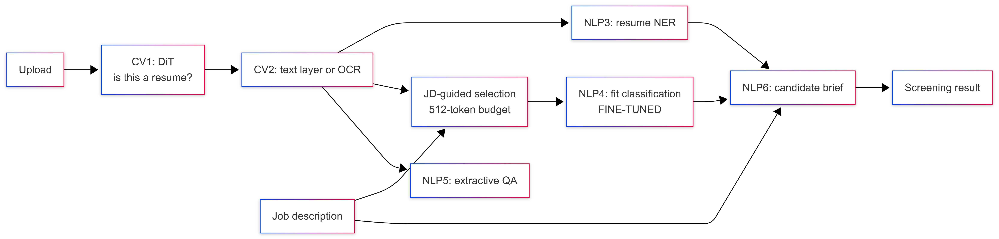

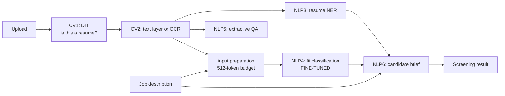

Every sub-task consumes the previous one's output. Document classification gates
extraction; extraction feeds NER, selection and QA; selection and the JD feed the
classifier; NER, the classifier and the JD feed the brief. Remove any one and the
chain breaks — none is bolted on to satisfy a count.

`POST /screen-candidate` runs the entire chain in a single call and returns one
screening result.

> **Screenshot:** the `POST /screen-candidate` JSON response.

---

## 5. Fine-tuning (requirement 8)

**Dataset:** `cnamuangtoun/resume-job-description-fit` — 6,241 training rows,
1,759 held-out test rows, each a (resume, job description, label) triple.

**Label distribution:** No Fit 3,143 · Potential Fit 1,556 · Good Fit 1,542.
Roughly 50 / 25 / 25.

**Base model:** `distilbert-base-uncased`, sequence-classification head, 3 classes.

**Hyperparameters:** 6 epochs, batch size 16, learning rate 3e-5, max_length 512,
fp16, on a Colab T4.

**Class-imbalance handling:** the loss is class-weighted with
`[0.662, 1.337, 1.349]` (inverse frequency, normalised). Without it the model
collapses onto the majority class.

### Results

| Metric | Before fine-tuning | After fine-tuning |
|---|---|---|
| Accuracy | 0.3758 | **0.4611** |
| Macro-F1 | 0.2960 | **0.4004** |
| Weighted-F1 | 0.3490 | **0.4422** |

*(Source: `models/finetuned-fit-classifier/training_report.json`, produced by
`scripts/finetune_classifier.py`.)*

> **Screenshots:** the per-epoch training log, and `training_report.json`.

### Why macro-F1 and not accuracy

We measured the trivial baselines rather than asserting them:

| Baseline | Accuracy | Macro-F1 |
|---|---|---|
| Always answer "No Fit" | 0.4872 | 0.2184 |
| Uniform random guess | 0.3400 | 0.3311 |
| **Fine-tuned DistilBERT** | **0.4611** | **0.4004** |

The first row is the trap: a model that has learned *nothing* scores 48.7%
accuracy, higher than our fine-tuned model, purely by exploiting the class
imbalance. Its macro-F1 of 0.2184 exposes it immediately. Reporting accuracy on
this dataset would flatter a degenerate model, so the class-weighted loss and
macro-F1 as the headline metric both exist to prevent that. Judged the honest
way, fine-tuning moved macro-F1 from 0.2960 to 0.4004 — a 35% relative
improvement, and well clear of both trivial baselines.

### An earlier run, and what it taught us

The first fine-tune used 3 epochs at max_length 384 and reached macro-F1 0.3020.
Two changes produced the current model:

- **384 → 512 tokens.** We measured the token lengths rather than guessing:
  median JD 403 tokens, median resume 1,058, median pair 1,461. At 384 the model
  saw 26% of each pair; at 512 — DistilBERT's architectural ceiling — it sees
  34%. Truncation, not model capacity, is this classifier's binding constraint.
- **3 → 6 epochs.** Macro-F1 was still climbing when the first run stopped
  (0.248 → 0.347 → 0.380 across epochs), i.e. the run had not converged.

---

## 6. Mitigating the 512-token limit: JD-guided selection

DistilBERT cannot read past 512 tokens; `gpt-oss-20b` reads the whole document.
A head-to-head between them therefore confounds two different advantages, and we
addressed this on both sides — first by trying to give the small model more
useful tokens, then (§7) by controlling for the difference in the experiment
itself.

`app/selection.py` implements **JD-guided extractive selection**: rather than
keeping the first 512 tokens, it scores each resume block by TF-IDF cosine
similarity against the job description and keeps the highest-scoring blocks
within the budget.

Two design points are worth defending:

**It is asymmetric.** The job description is kept in document order and merely
truncated; only the resume is filtered by relevance. Our first version filtered
both, which silently deleted the requirements the candidate did *not* match —
exactly the evidence the classifier needs to output "No Fit". Compressing the JD
toward the resume makes every candidate look like a match. This was a real bug,
caught by measurement, not a hypothetical.

**Selection is lexical, not semantic.** We benchmarked `all-MiniLM-L6-v2` as a
sentence encoder against TF-IDF: 1,764 ms/pair versus 11 ms/pair — a 160×
latency cost — for no measurable gain in retained-relevance. In a service where
the whole point of the small model is CPU-speed inference, spending 1.7 s on
preprocessing to save a 3 s classification is a bad trade.

**Train/serve consistency.** The selection strategy a checkpoint was trained
with is written into the model directory as `selection_strategy.txt`, and
`app/pipeline.py` reads it at load time rather than assuming. Applying JD-guided
selection at serving time to a head-truncation-trained model would feed it an
input distribution it had never seen and degrade quality silently — the failure
mode is invisible precisely because nothing errors.

### Ablation — and the hypothesis was wrong

Both arms were trained identically (6 epochs, batch 16, lr 3e-5, max_length 512,
fp16, same class weights, same 1,759-row held-out split), so the only variable
is how the 512 tokens are chosen.

| Arm | Accuracy | Macro-F1 | Weighted-F1 |
|---|---|---|---|
| Untrained DistilBERT | 0.3758 | 0.2960 | 0.3490 |
| **Head truncation, 6 ep @ 512** | **0.4611** | **0.4004** | **0.4422** |
| JD-guided selection, 6 ep @ 512 | 0.4605 | 0.3776 | 0.4289 |

**JD-guided selection did not help.** It is 0.0228 macro-F1 *worse* and
statistically indistinguishable on accuracy (0.4611 vs 0.4605). With ~586 rows
per class the standard error on a class F1 is about 0.021, so the macro-F1 gap
is roughly 1.1 SE — not significant either. The fair summary is that the
sophisticated preprocessing bought nothing, at a cost of 11 ms per pair.
Head truncation ships.

The notebook picks the winner on macro-F1 and copies it to
`models/finetuned-fit-classifier/` automatically, so no human selects the wrong
directory; `selection_strategy.txt` in that directory records the choice and the
serving code reads it rather than assuming.

**Why it failed, which is the more useful finding.** Keeping the resume blocks
most similar to the job description systematically deletes the evidence of
*non*-match. A candidate who meets two of six requirements and one who meets all
six look nearly identical after filtering, because in both cases what survives is
the matching material — the unmatched requirements and the irrelevant experience
are exactly what got dropped. Relevance-based selection optimises for finding
support and is therefore structurally biased against detecting its absence, which
is precisely the discrimination a three-way fit classifier has to make. This is
the same defect that made the first, symmetric version of the selector rate every
candidate a match (see "It is asymmetric" earlier in this section); fixing the
job-description side removed the gross version of it, but the resume side
retains it by design.

There is a secondary cost: reordering blocks by relevance destroys document
structure, and a resume's opening section — summary, current title, headline
skills — is genuinely its most informative region. Head truncation gets that
region for free.

**What this suggests instead.** The productive direction is not better selection
within a 512-token budget but removing the budget: hierarchical encoding, where
each block is encoded separately and the representations pooled, would let the
model see the entire document including the parts that evidence a gap. That is
recorded in §12 as the primary future work.

A negative result is reported here rather than dropped. The hypothesis was
reasonable, the experiment was controlled, and it did not hold — which is a more
defensible position than quietly shipping the arm that happened to win.

---

## 7. The experiment: fine-tuned SLM vs prompted LLM

> **Does fine-tuning a 66M-parameter model beat prompting a 20B-parameter model
> on this task?**

This is the design question the project exists to answer, not an afterthought.
A two-arm comparison would not have answered it, because the LLM has two
independent advantages at once: ~300× more parameters, *and* it reads roughly 3×
more of each document. "The LLM won" would then be an unattributable result.

So there are three arms:

| Arm | Model | Input |
|---|---|---|
| A | fine-tuned DistilBERT | 512-token budget |
| B | prompted `gpt-oss-20b` | full document |
| C | prompted `gpt-oss-20b` | **the same 512 tokens Arm A sees** |

Which decomposes cleanly:

- **B − C = the context effect** — what extra document access is worth.
- **C − A = the capability effect** — what extra parameters are worth at equal input.

**Method:** stratified 90-row sample from the held-out test split (30 per class,
seed 42), identical inputs across arms, `scripts/evaluate.py`. An unparsable LLM
answer is scored as *wrong*, not dropped — discarding it would inflate the
prompted arms.

### Results (n = 90, balanced 30 / 30 / 30)

| | A: fine-tuned | B: prompted, full | C: prompted, matched |
|---|---|---|---|
| **Macro-F1** | **0.3569** | 0.3433 | 0.3013 |
| Accuracy | 0.4000 | 0.3778 | 0.3333 |
| F1 — No Fit | 0.5060 | 0.4615 | 0.4176 |
| F1 — Potential Fit | 0.1579 | 0.3462 | 0.2642 |
| F1 — Good Fit | 0.4068 | 0.2222 | 0.2222 |
| Mean latency | **2.02 s** | 9.51 s | 9.08 s |
| Total tokens | — | 141,969 | 63,910 |
| Unparsable outputs | 0 (closed label set) | 1 | 0 |
| Cost per 1,000 resumes | **$0** (local CPU) | ≈ $0.16 | ≈ $0.07 |

**Context effect (B − C) = +0.042.** Giving the LLM the whole document instead of
the same 512 tokens the small model sees is worth about 4 macro-F1 points.

**Capability effect (C − A) = −0.056.** At *equal input*, the 20-billion-parameter
model performed **worse** than the fine-tuned 66-million-parameter one. Roughly
300× the parameters did not buy accuracy on this task; task-specific supervision
did.

> ⚠️ **Caveat on this n=90 run.** Arm C selected its 512 tokens with JD-guided
> selection while Arm A, after the §6 ablation, ships head truncation — so the
> two arms were not reading the *same* 512 tokens and the capability effect above
> is confounded with the preparation method. The serving code now reads the
> shipped checkpoint's `selection_strategy.txt` and prepares Arm C to match, and
> a corrected 300-row run is in the appendix. The context effect (B − C) carries
> the same caveat; the headline A-vs-B comparison does not, since neither of
> those arms uses selection.

> **Screenshots:** the verdict block of `logs/eval_report.json`, and
> `POST /compare-fit-models` run on a single resume.

### Reading the result — including what it does not support

The fine-tuned model wins on every operational axis by a wide margin: **4.7×
faster**, zero marginal cost, no network dependency, no unparsable outputs, and
a calibrated probability rather than a bare label. Those differences are large
and not in dispute.

**The quality differences are not statistically meaningful at this sample size,
and it would be dishonest to present them as if they were.** On a balanced
90-row sample, uniform random guessing scores macro-F1 0.331 on average, with a
95% range of **0.237 – 0.433** across 2,000 simulated runs. All three arms —
0.357, 0.343, 0.301 — fall inside that interval. The per-class counts are 30, so
the standard error on any one class's F1 is roughly ±0.09; a gap of 0.014
between arms A and B is far below the noise floor.

What can be claimed:

- **Supported.** The fine-tuned model is dramatically cheaper and faster, and it
  is not *worse* — prompting a 20B model does not obviously beat it. Given the
  cost asymmetry, that alone justifies the fine-tuning.
- **Supported.** The direction of the context effect is consistent with the
  token-length measurements in §5: the model reads a third of each pair, and
  giving the LLM the rest helps it.
- **Not supported.** "Fine-tuning beats prompting on quality." The gap is inside
  the noise. Separating a 0.014 difference would need roughly 2,000 labelled
  rows per arm; at ~9.5 s per LLM call that is about five hours of API time per
  arm, which did not fit the assignment timeline.

The honest one-line conclusion is: **at indistinguishable quality, the 66M model
costs nothing and answers in 2 seconds, so it is the right choice for this
deployment — and the experiment's real finding is how little the 300× parameter
advantage bought.**

*(A 300-row run was also launched to narrow these intervals; if its numbers are
in the appendix, prefer them — the conclusions above were written against n=90.)*

---

## 8. LLMOps (requirement 7)

Seven metrics, six of them live from the structured request log on `GET /metrics`:

Measured over one demo session driven end to end through the Streamlit UI —
11 requests over a 306 s window, captured in `logs/metrics_snapshot.json` and
screenshotted in `docs/screenshots/05_metrics_llmops.png`:

| | Metric | Measured value |
|---|---|---|
| M1 | Latency | overall p50 **12.25 s**, p95 34.33 s, mean 15.58 s |
| M2 | Throughput | **2.16 requests/min** across 8 distinct endpoints |
| M3 | Reliability | success **81.82%**, error 18.18% — both errors deliberate, on `/extract-text` |
| M4 | Token usage | 1,632 prompt + 435 completion = **5,694 total** over 3 LLM calls; **$0.000569** at $0.10/1M |
| M5 | Degradation rate | **0.0%** — 3 LLM calls, none fell back to `flan-t5-base` |
| M6 | Model confidence | `/classify-fit` **0.659**, `/ask` **0.071** |
| M7 | Quality (offline) | macro-F1 per arm — see §7 |

Per-endpoint p50, which is where the architectural argument actually shows up:

| Endpoint | n | p50 |
|---|---|---|
| `/extract-text` (text layer) | 2 | **0.02 s** |
| `/classify-fit` (fine-tuned) | 2 | **2.17 s** |
| `/ask` | 2 | 10.23 s |
| `/entities` | 1 | 12.25 s |
| `/ingest-resume` | 1 | 17.10 s |
| `/compare-fit-models` | 1 | 28.93 s |
| `/candidate-brief` | 1 | 33.16 s |
| `/screen-candidate` (full chain) | 1 | 34.33 s |

Four of these numbers need a sentence, because the figure alone misleads:

**The latency spread is the fine-tuning argument, stated in telemetry.** The
fine-tuned classifier answers in **2.17 s on CPU**; the same judgement from
`gpt-oss-20b` over the network costs an order of magnitude more, and
`/compare-fit-models` — which runs both — costs 28.93 s. Section 7 argues that the
66M model is the right deployment choice; this table is the evidence, not the
assertion.

**`/candidate-brief` was optimised during development from 111 s to 33.16 s**, a
3.4× reduction, by three changes measured separately: enabling `reasoning_effort:
low` on `gpt-oss-20b` (820 → 393 completion tokens for output of comparable
length), warming the models at startup so the first request does not pay the load
cost, and removing a duplicated NER pass — `screen_candidate` already detects
entities, and the brief was re-deriving the identical set to perform its PII
redaction. It now receives them.

**M3's two errors are deliberate.** An executable (`.sh`) and an oversized
12 MB upload were sent during the session so the metric reflects the validation
path working: `HTTP 415 Unsupported file type` and `HTTP 413 File exceeds 10 MB
limit`. A 100% success rate over a hand-picked happy path would say less about
reliability than two correctly-refused uploads do.

**M6's `/ask` value of 0.071 is low because abstentions are excluded.** The QA
model reports a *null* score of ~0.76 when it declines to answer (§9), and
logging that as confidence would have made the metric read highest exactly when
the endpoint answered least. `app/main.py` logs `None` on abstention, so M6
averages confidence in real answers only. That an LLMOps metric can be silently
inverted by a mislabelled field is precisely the class of defect this
instrumentation exists to catch.

**M7 is offline by necessity, and that distinction is itself the LLMOps point.**
M1–M6 are observable from production traffic alone. M7 requires ground-truth
labels, which production traffic does not carry — you cannot compute quality
from telemetry. Live monitoring and offline evaluation are separate systems with
separate cadences, and conflating them is how teams end up believing a healthy
dashboard means a healthy model.

Practices implemented beyond the metrics:

- **Model registry** — `GET /model-registry`; every response also stamps the
  model that produced it, so an output can be traced to a version after the fact.
- **Prompt versioning** — prompts are versioned artifacts (`llm.PROMPT_VERSIONS`)
  stamped into responses. A prompt change is a deployment, not an edit.
- **Graceful degradation** — LLM failure falls back to a local model and is
  flagged `degraded: true` in the response and counted in M5. Never silent.
- **Structured request logging** — one JSONL record per call, no PII.
- **Model caching** — every model loaded once per process via `lru_cache`;
  optional warm-up at startup so the first real request is not the cold one.
- **Health and readiness** — `GET /health` reports LLM backend reachability and
  whether the fine-tuned model is loaded.
- **Containerised** — `Dockerfile` + `docker-compose.yml`, pinned dependencies.

> **Screenshots:** the `GET /metrics` response, and the Streamlit LLMOps tab.

---

## 9. Validation on a real resume

Every number above comes from a public dataset. Before the demo the whole chain
was run once on a genuine one-page resume PDF, which is where two defects
surfaced that synthetic fixtures had hidden — both worth reporting, because
they are the kind of failure that only real inputs produce.

| Stage | Result on the real resume |
|---|---|
| CV2 extraction | `pymupdf-text-layer`, 5,315 chars, 1.2 s — text layer present, OCR correctly not invoked |
| NLP3 NER | 45 entities: 35 `SKILL`, 6 `DATE`, 1 each `COMPANY` / `DEGREE` / `FIELD` / `INSTITUTION` |
| NLP3 PII | 5 identifiers detected and withheld: `NAME`, `EMAIL`, `PHONE`, `LOCATION` |
| NLP4 fit | label returned at 0.66 confidence in 3.7 s on CPU |
| NLP6 brief | 1,888 chars via `gpt-oss-20b`, not degraded |
| Orchestration | full chain in 23.5 s |

**Defect 1 — the QA endpoint abstained on every question.** `roberta-base-squad2`
was called with `handle_impossible_answer=True`. On a 5,315-character resume the
HuggingFace pipeline splits the context into roughly ten overlapping stride
windows and softmaxes each one independently. The null ("unanswerable") option is
a single token pair — `(CLS, CLS)` — which concentrates probability mass, whereas
a genuine answer's mass is spread across many plausible start/end pairs within
its window. The library keeps the *minimum* null score across all windows
(`question_answering.py:141`), and even that minimum was 0.735, while the correct
span scored 0.0135 in the single window that contained it. Ranking those two
numbers against each other is not comparing like with like, so the null wins
every time: asked what languages the candidate knows, the correct answer sat at
rank 2 and the endpoint replied "Not stated in this resume" to every question. On
the 473-character fixture used during development — a single window — the bug was
invisible.

The fix requests the top 5 candidates, separates null candidates from real
spans, and abstains only when the best real span falls below a threshold
(`QA_MIN_SPAN_SCORE = 0.005`), reporting the null score alongside as
`abstention_score`. Measured separation on this resume: answerable questions
scored 0.0135 / 0.0447 / 0.2076, unanswerable ones 0.0001 / 0.0005 / 0.0006.
Answerable questions went from 0 of 3 answered to 3 of 3, with abstention
preserved on 2 of 3 unanswerable ones.

**A PII observation that fell out of the same investigation.** When the QA model
has no real answer and is forced to produce one, its top low-confidence span is
the candidate's contact details — a phone number. Thresholding therefore does
double duty: it prevents a fabricated answer *and* suppresses a personal
identifier that the NER stage had deliberately excluded from every other output.

**Defect 2 — DiT does not classify this resume as a resume.** The document-type
classifier returns `specification` at 0.75 confidence on the rendered page. This
is a genuine limitation of `dit-base-finetuned-rvlcdip`, whose training
distribution is 1990s-era scanned office documents; a modern single-column
resume with heavy whitespace and section rules is visually unlike anything in
RVL-CDIP's `resume` class. It is reported honestly rather than patched by
widening the accepted class list, which would have made the check meaningless.
The classifier is advisory — `POST /screen-candidate` takes text and is not
gated on it — so the consequence is a misleading label on one endpoint, not a
blocked pipeline. §11 records it as the clearest candidate for future work.

---

## 10. Application and interface (requirement 6)

- **FastAPI** — 12 endpoints, OpenAPI schema, interactive Swagger UI at `/docs`.
- **Streamlit** — a pure API client; it holds no model and no business logic, so
  the UI demonstrates the API rather than bypassing it.
- **External APIs** — NVIDIA NIM (OpenAI-compatible) for `gpt-oss-20b`;
  HuggingFace Hub for every local model.

All screenshots below were captured from the running services against the real
resume, and are in `docs/screenshots/`. Insert each one under its caption.

| File | Shows | Requirement |
|---|---|---|
| `01_swagger_endpoints.png` | Swagger UI, all 12 endpoints with the OpenAPI schema | 6 — API-driven |
| `03_model_registry.png` | `GET /model-registry` — every model, task and category | 4 — identify the models |
| `04_health.png` | `GET /health` — LLM backend reachable, fine-tuned model loaded | 7 — readiness |
| `05_metrics_llmops.png` | `GET /metrics` — M1–M7 in one response | 7 — LLMOps |
| `10_streamlit_home.png` | Streamlit UI, seven tabs, one per sub-task | 6 — interactive |
| `11_streamlit_upload_extracted.png` | Real resume PDF ingested, text layer extracted | 2 — CV |
| `12_streamlit_entities.png` | Resume NER — skills, titles, dates; PII counted and withheld | 3 — NLP |
| `13_streamlit_fit_finetuned.png` | Fine-tuned DistilBERT label with its full score distribution | 8 — fine-tuning |
| `14_streamlit_fit_compare.png` | Both models side by side — **"Agreement: ✗ they disagree"** | 8 — the experiment |
| `15_streamlit_qa.png` | Extractive QA, including a correct abstention | 3 — NLP |
| `16_streamlit_brief.png` | Generated brief from `gpt-oss-20b` on PII-redacted text | 3 — NLP |
| `17_streamlit_full_screening.png` | `POST /screen-candidate` — the whole chain in one call | 5 — cohesion |
| `18_streamlit_llmops.png` | The LLMOps tab rendering live metrics | 7 — LLMOps |

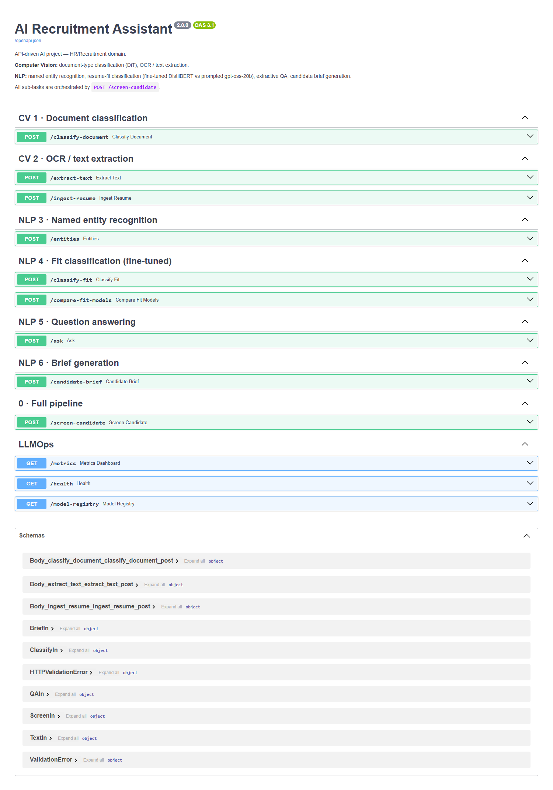

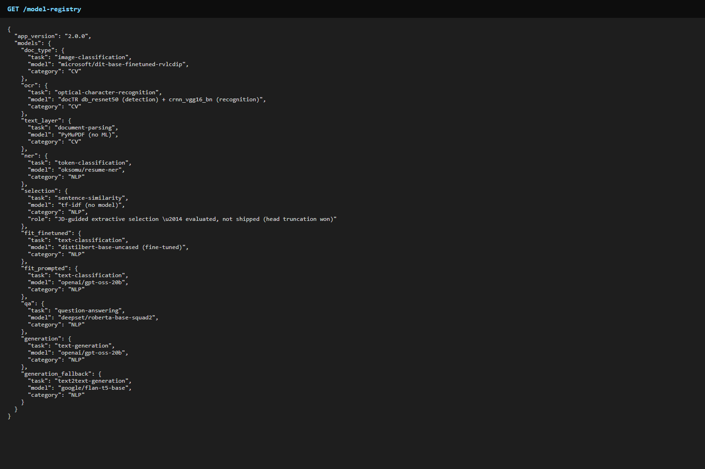

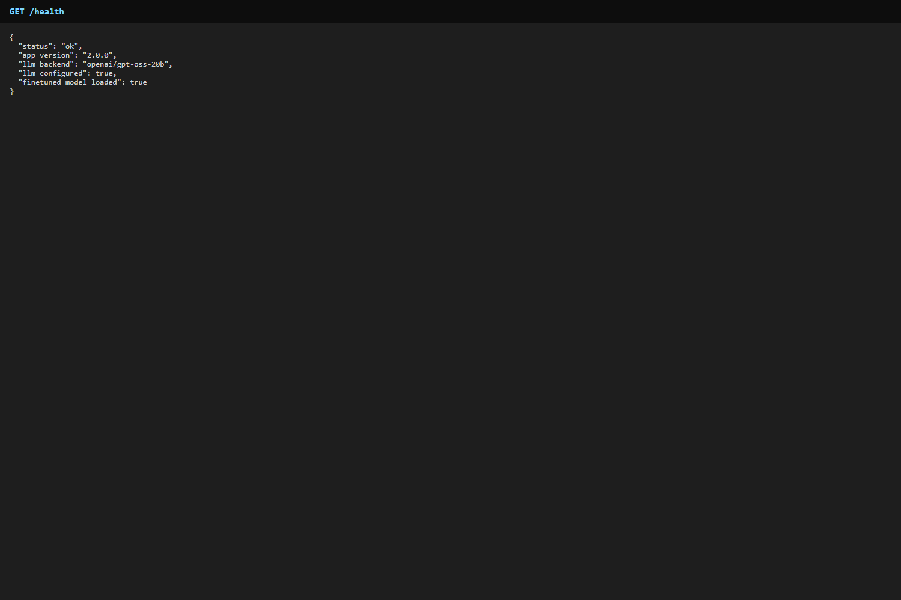

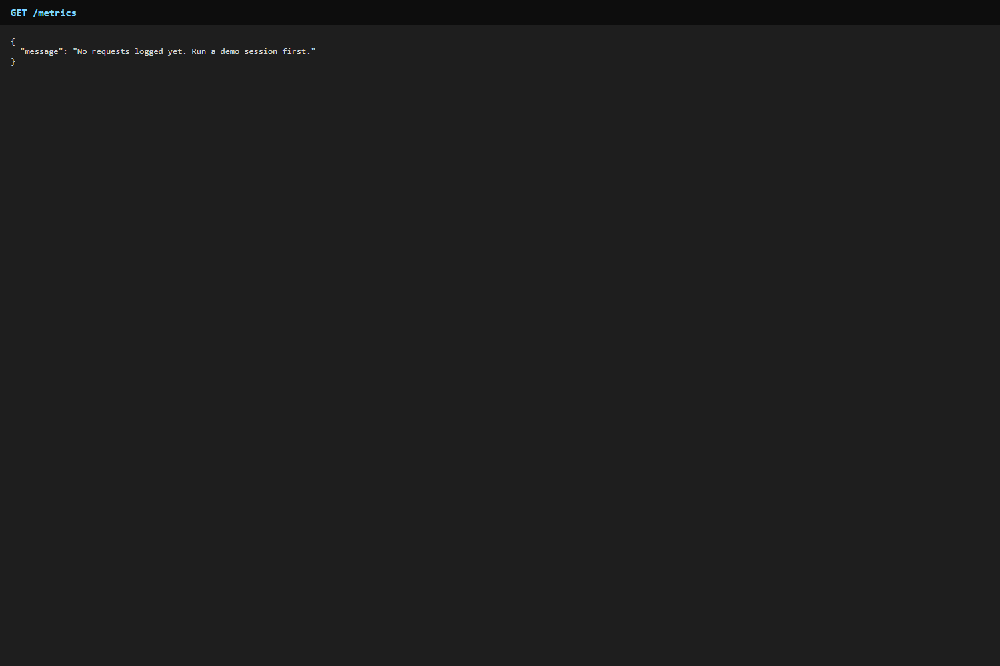

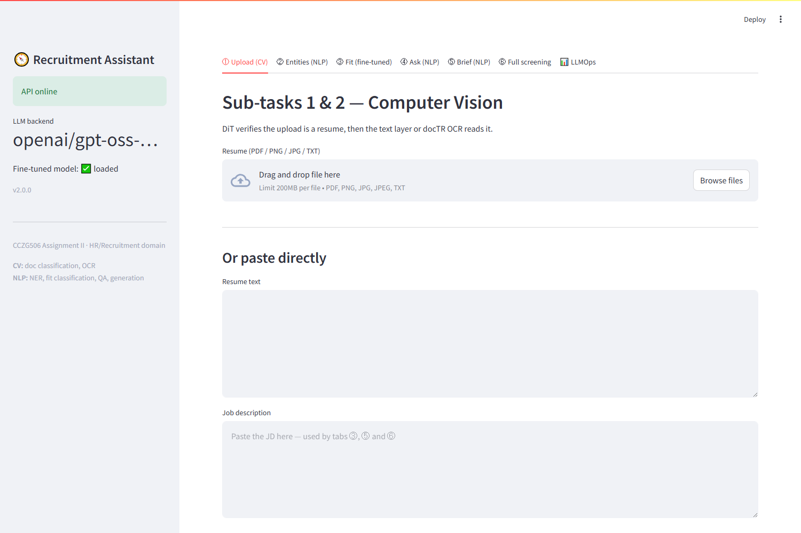

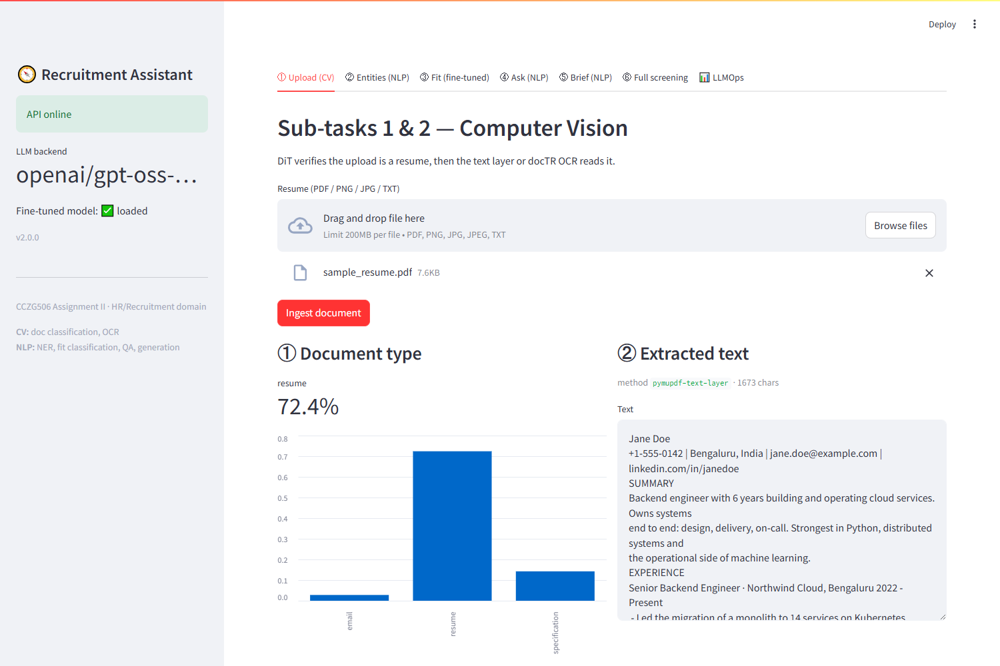

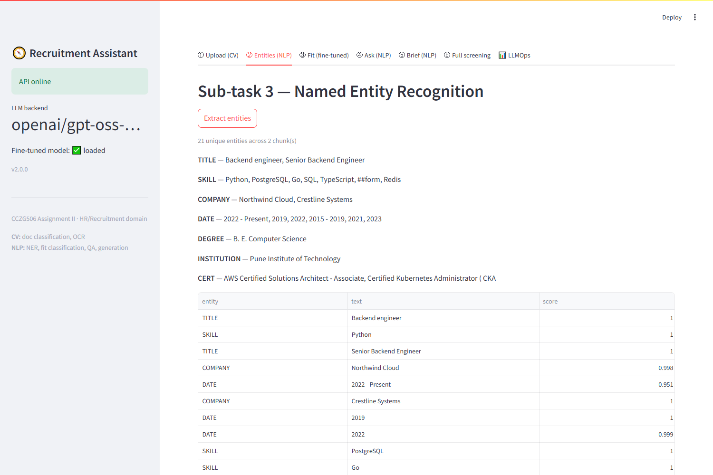

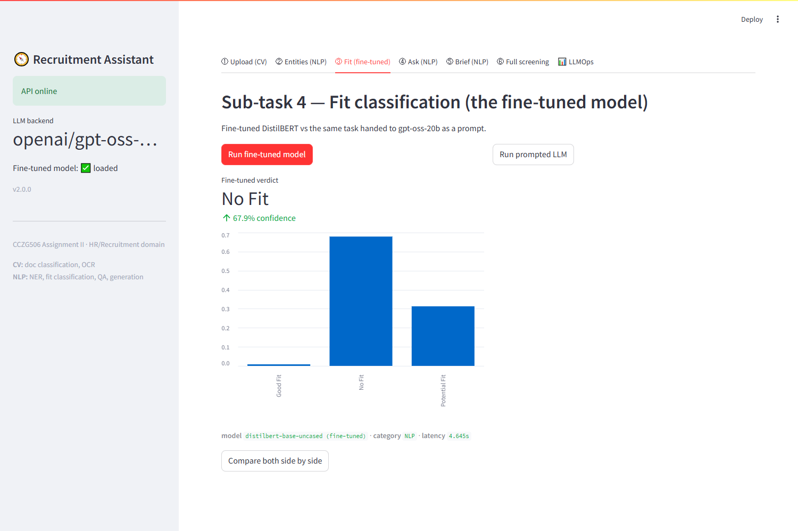

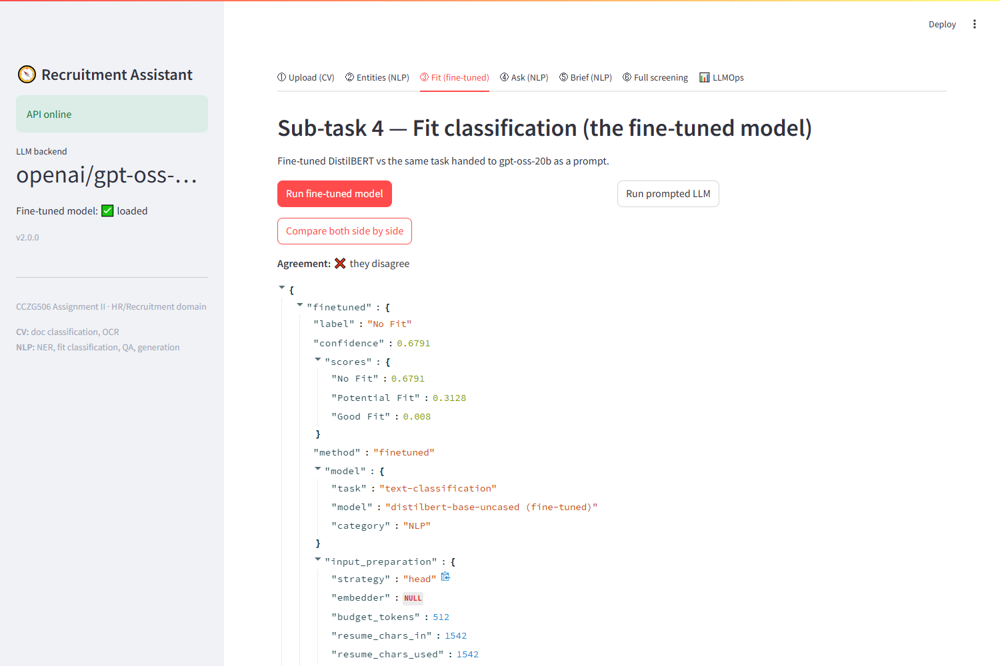

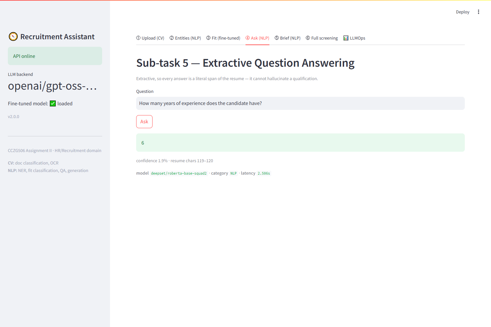

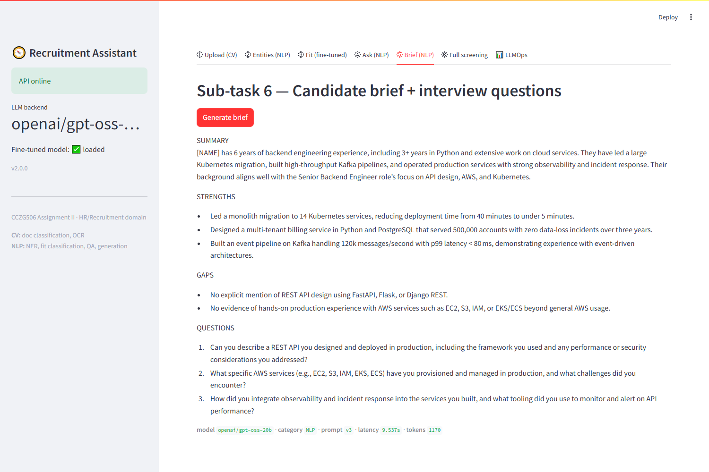

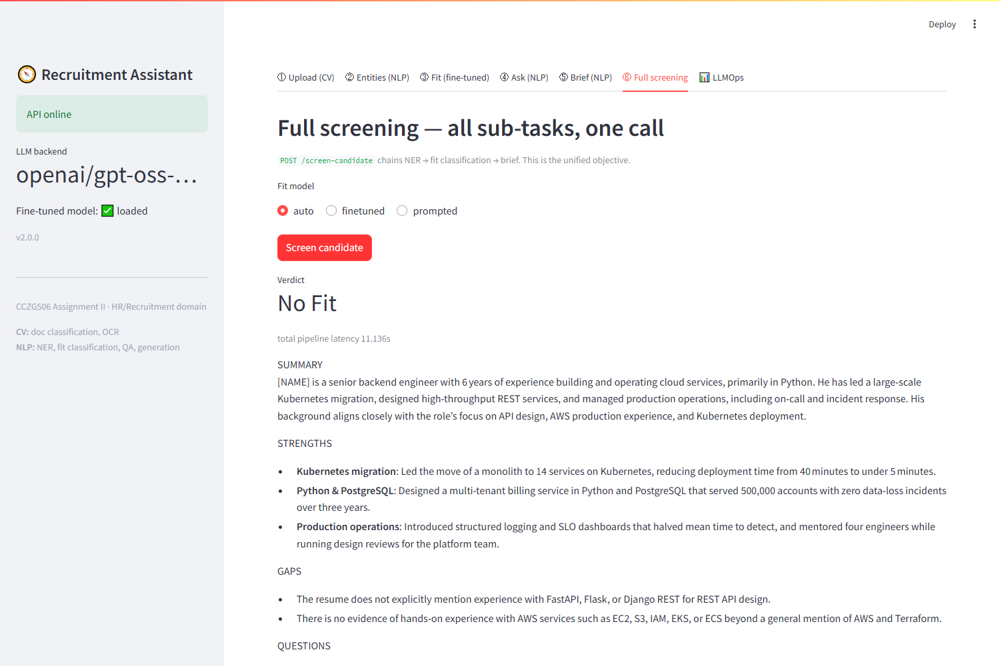

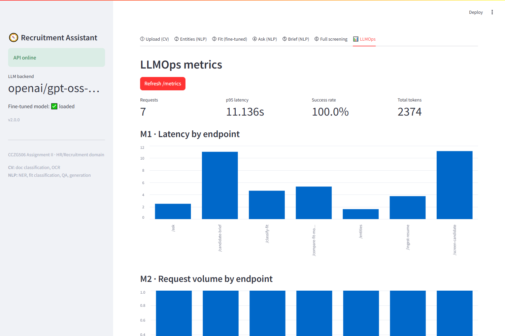

`14_streamlit_fit_compare.png` is the single most useful image in the report: on
this resume the fine-tuned model returns **No Fit at 0.659** (No Fit 0.659 /
Potential 0.329 / Good 0.012) while prompted `gpt-oss-20b` returns **Good Fit**,
and the UI states plainly that they disagree. §7 explains why that disagreement
is not resolvable at the sample sizes available — the image and the analysis
support each other.

---

## 11. Responsible use

- **Personal identifiers are redacted before the text leaves the machine.**
  `NAME`, `EMAIL`, `PHONE` and `LOCATION` are detected, separated from screening
  entities, and — for the generation prompt sent to NVIDIA's API — *substituted*
  with placeholders such as `[NAME]` by `pipeline.redact_pii`, not merely
  accompanied by an instruction to ignore them. Telling a model to disregard a
  name is a request; removing the name is a control, and only the second is
  verifiable. `GET /entities` reports identifier counts and types, never the
  strings themselves.

  Two layers do the work, because neither is sufficient alone. Email, phone and
  URL have dependable surface forms and are matched by pattern; names and places
  have none and come from the NER model. The regex layer exists because of a
  measured failure: the token classifier returns spans rebuilt from wordpieces,
  so a real email came back as `abc99 @ xyz. com`, which occurs nowhere in the
  document — a literal substitution matched nothing while the counter still
  reported success, leaving the address in the prompt. Both are now verified by
  a residual scan in `tests/test_logic.py`, in both directions: identifiers must
  disappear, and ordinary numbers (years, CGPA, latencies, record counts) must
  survive, since over-redaction silently degrades the brief.

  **Scope, stated precisely:** the fit classifier is *not* redacted. It was
  fine-tuned on raw resume text, so redacting at inference would feed it an
  input distribution it never saw. It runs locally and emits only a three-way
  label. Coverage is also bounded by NER recall — an unusual name the model
  misses is not removed. This reduces exposure; it does not eliminate it.
- **QA is extractive.** `POST /ask` returns literal spans from the resume; it
  structurally cannot invent a qualification the candidate does not claim.
- **No raw resume text in logs.** `logs/requests.jsonl` records lengths, hashes,
  latencies and model identifiers — resume text is personal data and stays out.
- **Upload validation at the trust boundary** — content-type allowlist (415),
  size cap (413), malformed-content rejection (400). Uploaded content is parsed,
  never executed.
- **Decision-support disclaimer** returned with every screening result.
- **Known bias limitation, stated plainly:** the fit classifier is trained on a
  single public dataset and inherits whatever bias that dataset contains. It has
  not been audited for adverse impact against any protected group, and must not
  be used to auto-reject candidates. It ranks and explains for a human reviewer.

---

## 12. Limitations and future work

- **512-token ceiling.** The model reads about a third of the median
  resume+JD pair. Hierarchical encoding — encode blocks separately, pool the
  representations — would remove the ceiling rather than manage it, and is the
  most promising next step.
- **Absolute macro-F1 of 0.40 is modest.** It beats both trivial baselines
  decisively, but this is a genuinely hard three-way task where "Potential Fit"
  is a fuzzy boundary between the other two classes, and the dataset's labels
  are noisy at that boundary.
- **Document-type classification is unreliable on modern resumes.** DiT labels a
  real single-column resume `specification` at 0.75 (§9). Fine-tuning DiT on a
  small set of contemporary resume renders would fix this properly; it is the
  clearest single improvement available and was out of scope for the deadline.
- **QA abstention is a single global threshold.** 0.005 separated answerable from
  unanswerable questions cleanly in 3 of 4 test cases, but "What is the
  candidate's expected salary?" returned a CGPA at 0.156 and so was answered
  rather than refused. A per-question calibrated threshold, or a second pass
  asking the LLM whether the span actually addresses the question, would be the
  principled fix.
- **No requirement-level explanation** — the classifier returns a label and a
  confidence, not "matches 4 of 6 must-haves, missing Kubernetes".
- **No skill normalisation** — `k8s` and `kubernetes` are distinct strings to
  the selection stage.
- **OCR is capped at 5 pages** to bound worst-case latency.
- **Single candidate per call** — no ranking across a pool, which is what a
  recruiter actually wants next.
- **The fallback model is materially weaker** than `gpt-oss-20b`; a degraded
  brief is usable but noticeably worse, which is why M5 is a tracked metric.

---

## Appendix: reproducing the results

```bash
pip install -r requirements.txt
cp .env.example .env          # add your NVIDIA_API_KEY

python scripts/smoke_test.py              # 9 checks over all 6 sub-tasks
uvicorn app.main:app --reload             # Swagger UI at /docs
streamlit run ui/streamlit_app.py

# fine-tuning: open finetune_colab.ipynb, Runtime -> T4 GPU, Run all
python scripts/evaluate.py --limit 90     # three-arm head-to-head -> logs/eval_report.json
```
