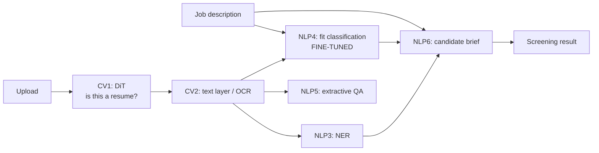

# Report scaffold — <groupid>.docx

10 of the 15 marks are the Word document. Paste these sections in, drop the
screenshots where marked, and fill the `<...>` placeholders. Every claim below
is backed by something the running app actually produces — do not write a
number you have not screenshotted.

---

## 1. Group details

| Sl. | BITS ID | Name | Contribution (qualitative) | % |
|---|---|---|---|---|
| 1 | | | | |
| 2 | | | | |

Percentages must total 100. Be specific in the qualitative column — "CV
sub-tasks and OCR pipeline", "fine-tuning and evaluation harness", "LLMOps
metrics and Docker", not "helped with coding".

---

## 2. Domain and objective

> **Domain:** HR / Recruitment.
> **Problem:** a recruiter screening a role receives hundreds of resumes in
> mixed formats — text PDFs, scanned images, DOCX exports — and must judge each
> against one job description consistently and defensibly.
> **Objective:** a single API-driven service that ingests a resume in any of
> those formats, extracts structured facts, scores fit against the job
> description, answers follow-up questions, and drafts a screening brief.

**Categories chosen:** Computer Vision and Natural Language Processing.
*(The third category, Speech Recognition, was not selected — no part of resume
screening involves audio, and adding it would have broken requirement 5's
cohesion rule.)*

---

## 3. Sub-tasks and models (requirements 3 and 4)

Paste the table from README §1, then **screenshot `GET /model-registry`** as
proof the models are what the report claims.

For each sub-task write two sentences: what it does, and why that model.
Justifications to draw on:

- **DiT (`dit-base-finetuned-rvlcdip`)** — pre-trained on 400k document images
  across 16 classes, one of which is literally `resume`. Purpose-built for
  document-image classification rather than natural-image classification.
- **docTR (`db_resnet50` detection + `crnn_vgg16_bn` recognition) + PyMuPDF** —
  two learned CV models: one locates every word box on the page, the second
  reads it. OCR runs only when there is no text layer, so recognition error is
  not introduced where it is avoidable.
- **`dslim/bert-base-NER`** — BERT fine-tuned on CoNLL-03; recovers ORG/PER/LOC
  which map to employers, references and locations on a resume.
- **DistilBERT** — 66M params, 6× faster than BERT-base at ~97% of its quality;
  the right size for a task that must run per-resume on CPU.
- **`roberta-base-squad2`** — trained with unanswerable questions, so it can
  say "not stated" instead of forcing a wrong span.
- **`gpt-oss-20b` via NVIDIA NIM** — open-weight 20B model on a free
  OpenAI-compatible endpoint; used where the task is genuinely generative.

---

## 4. Cohesion (requirement 5)

Include the architecture diagram, then explain the chain:

Point to `POST /screen-candidate` as the single call that runs the chain.
**Screenshot its JSON response.**

---

## 5. Fine-tuning (requirement 8)

State: dataset, size, label distribution, base model, hyperparameters, and the
class-imbalance handling. Then the results table:

| Metric | Before fine-tuning | After fine-tuning |
|---|---|---|
| Accuracy | <from training_report.json> | |
| Macro-F1 | | |
| Weighted-F1 | | |

**Screenshots:** the training log with per-epoch eval, and
`training_report.json`.

Explain why macro-F1 rather than accuracy: the dataset is ~50% "No Fit", so a
model that always answers "No Fit" scores 50% accuracy and 0.22 macro-F1. The
weighted loss and the metric choice both exist to catch that.

---

## 6. The experiment: fine-tuned SLM vs prompted LLM

This is the section that earns viva marks. State the question plainly:

> Does fine-tuning a 66M-parameter model beat prompting a 20B-parameter model
> on this task?

Method: stratified 100-row sample from the held-out test split, identical
inputs to both arms, `scripts/evaluate.py`.

| | Fine-tuned DistilBERT | Prompted gpt-oss-20b |
|---|---|---|
| Macro-F1 | | |
| Accuracy | | |
| Mean latency | | |
| Cost per 1k resumes | $0 (local CPU) | |
| Unparsable outputs | 0 (closed label set) | |

**Screenshots:** `logs/eval_report.json` verdict block, and
`POST /compare-fit-models` on one resume.

Whichever arm wins, say so honestly and explain the trade-off. If the prompted
LLM wins on F1, the fine-tuned model still wins on latency, cost, offline
operation, and calibrated probabilities — and that is a real engineering
argument, not a consolation prize.

---

## 7. LLMOps (requirement 7)

Paste the M1–M7 table from README §7 with **your actual numbers** from a demo
session, plus the practices list. **Screenshot the `/metrics` response and the
Streamlit LLMOps tab.**

Note explicitly that M7 is offline because it requires labels — that
distinction between live telemetry and offline quality evaluation is itself an
LLMOps point.

---

## 8. Application screenshots (requirement 6)

Follow the checklist in README §8. Caption each one with what it demonstrates
and which requirement it satisfies.

---

## 9. Responsible use

Cover, briefly:

- Protected characteristics excluded from scoring and from the LLM prompt
- Extractive QA cannot invent qualifications
- No raw resume text in logs — hashes and lengths only
- Upload validation: type allowlist, size cap, no execution of uploaded content
- Decision-support disclaimer returned with every screening result
- Known limitation: the fit model is trained on one public dataset and will
  carry whatever bias that dataset contains; it is not audited for adverse
  impact and must not be used to auto-reject candidates

---

## 10. Limitations and future work

Be candid — examiners reward it:

- Fit classification truncates at 384 tokens; long resumes lose their tail
- No requirement-level explanation yet, only a label plus confidence
- Skill normalisation (aliases, `k8s` → `kubernetes`) is not implemented
- OCR is capped at 5 pages
- Single-candidate only; no ranking across a candidate pool
- The fallback model is materially weaker than `gpt-oss-20b`
