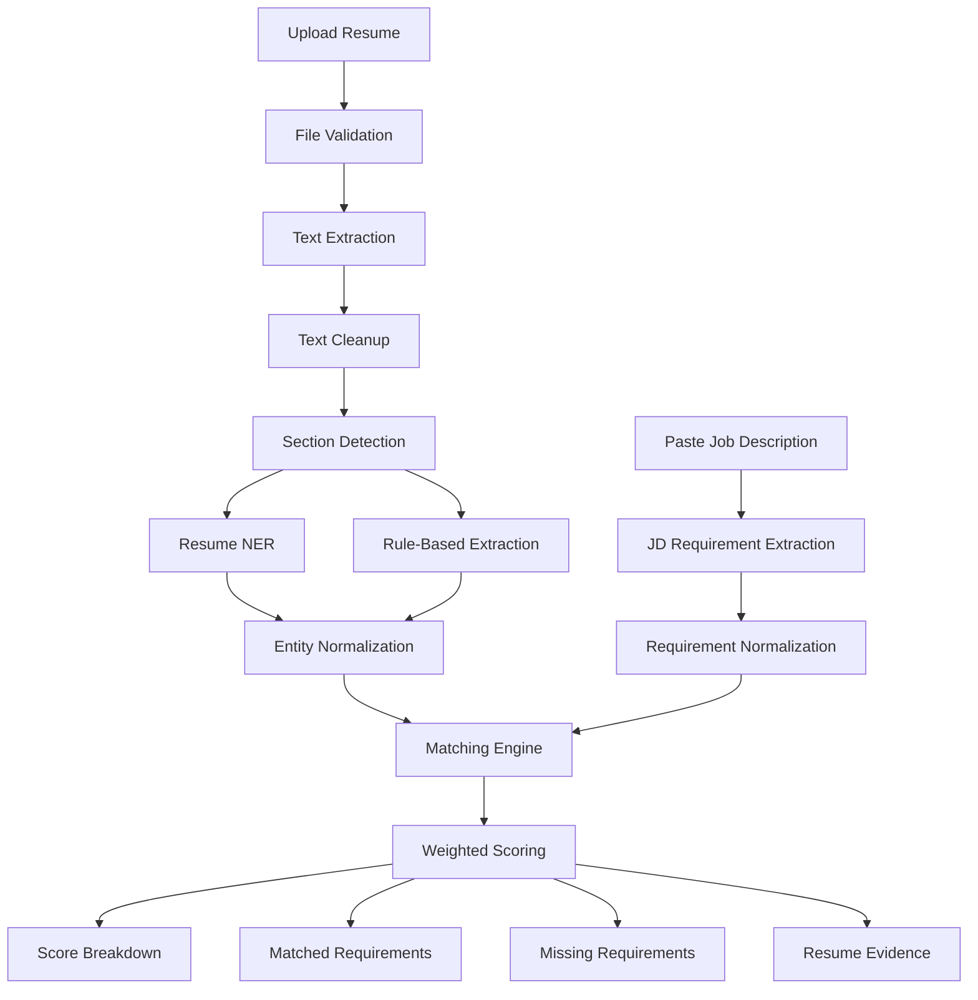

# Resume–Job Description Matching Web App

## 1. Overview

This project is a simple web application that:

1. Accepts a candidate resume in PDF, DOCX, or TXT format.
2. Accepts a job description as pasted text.
3. Extracts structured information from the resume.
4. Extracts requirements from the job description.
5. Matches the candidate against the role.
6. Returns an explainable relevance score.

The system does not require a generative large language model. It uses existing NLP models, rules, dictionaries, fuzzy matching, and sentence embeddings.

The goal is not to make an automatic hiring decision. The score should help a recruiter or hiring manager review candidates more consistently.

---

## 2. Main Features

- Resume upload: PDF, DOCX, and TXT
- Resume text extraction
- Resume section detection
- Named entity recognition for:
  - Skills
  - Job titles
  - Companies
  - Degrees
  - Institutions
  - Certifications
  - Employment dates
- Job description requirement extraction
- Skill normalization and alias handling
- Exact, fuzzy, and semantic matching
- Weighted candidate relevance score
- Matched and missing requirements
- Evidence from the resume for each match
- JSON API and simple browser interface

---

## 3. Recommended Technology Stack

### Backend

- Python 3.11+
- FastAPI
- Uvicorn
- Pydantic

### Document parsing

- PyMuPDF for PDF files
- python-docx for DOCX files
- Standard Python file handling for TXT files
- Optional OCR fallback for scanned PDFs

### NLP and matching

- Hugging Face Transformers
- `oksomu/resume-ner` or `yashpwr/resume-ner-bert-v2`
- Sentence Transformers
- `TechWolf/JobBERT-v2` or `all-MiniLM-L6-v2`
- spaCy
- RapidFuzz
- dateparser
- scikit-learn

### Frontend

For a simple production-style MVP:

- HTML
- CSS
- Vanilla JavaScript
- FastAPI static files and templates

For the fastest possible prototype, Streamlit can replace the separate frontend.

---

## 4. System Architecture



---

## 5. Important Design Decision

Do not calculate the final score using only one cosine similarity between the full resume and the full job description.

A whole-document similarity score is difficult to explain and can be affected by:

- Resume length
- Repeated keywords
- Irrelevant sections
- Generic wording
- Formatting noise
- Missing distinction between required and preferred skills

Instead, split the job description into individual requirements and compare each requirement with relevant resume evidence.

NER should be used to extract structured information. It should not be responsible for the final hiring score.

---

## 6. Project Structure

```text
resume-jd-matcher/
├── app/
│   ├── main.py
│   ├── config.py
│   ├── schemas.py
│   ├── api/
│   │   └── routes.py
│   ├── parsers/
│   │   ├── pdf_parser.py
│   │   ├── docx_parser.py
│   │   ├── txt_parser.py
│   │   └── resume_parser.py
│   ├── nlp/
│   │   ├── resume_ner.py
│   │   ├── jd_extractor.py
│   │   ├── section_detector.py
│   │   ├── normalizer.py
│   │   └── embeddings.py
│   ├── scoring/
│   │   ├── matcher.py
│   │   └── scorer.py
│   ├── data/
│   │   ├── skill_aliases.json
│   │   ├── degree_aliases.json
│   │   └── section_headings.json
│   ├── templates/
│   │   └── index.html
│   └── static/
│       ├── app.js
│       └── styles.css
├── tests/
│   ├── test_parsers.py
│   ├── test_normalizer.py
│   ├── test_matcher.py
│   └── test_scorer.py
├── sample_data/
├── requirements.txt
├── Dockerfile
├── .env.example
└── README.md
```

---

## 7. Installation

Create a virtual environment:

```bash
python -m venv .venv
```

Activate it:

```bash
# macOS or Linux
source .venv/bin/activate

# Windows PowerShell
.venv\Scripts\Activate.ps1
```

Install dependencies:

```bash
pip install fastapi uvicorn python-multipart jinja2
pip install pymupdf python-docx
pip install transformers torch sentence-transformers
pip install spacy rapidfuzz dateparser scikit-learn
```

Example `requirements.txt`:

```text
fastapi
uvicorn[standard]
python-multipart
jinja2
pydantic
pymupdf
python-docx
transformers
torch
sentence-transformers
spacy
rapidfuzz
dateparser
scikit-learn
numpy
```

Always pin tested package versions before deployment.

---

## 8. Configuration

Create `app/config.py`:

```python
from pydantic_settings import BaseSettings


class Settings(BaseSettings):
    max_upload_size_mb: int = 10
    resume_ner_model: str = "oksomu/resume-ner"
    embedding_model: str = "TechWolf/JobBERT-v2"
    semantic_match_threshold: float = 0.72
    fuzzy_match_threshold: int = 88

    class Config:
        env_file = ".env"


settings = Settings()
```

Example `.env`:

```env
MAX_UPLOAD_SIZE_MB=10
RESUME_NER_MODEL=oksomu/resume-ner
EMBEDDING_MODEL=TechWolf/JobBERT-v2
SEMANTIC_MATCH_THRESHOLD=0.72
FUZZY_MATCH_THRESHOLD=88
```

Verify model licenses and usage restrictions before production deployment.

---

## 9. Resume Text Extraction

### PDF parser

Create `app/parsers/pdf_parser.py`:

```python
import fitz


def extract_pdf_text(file_bytes: bytes) -> str:
    document = fitz.open(stream=file_bytes, filetype="pdf")
    pages: list[str] = []

    for page in document:
        text = page.get_text("text")
        if text.strip():
            pages.append(text)

    return "\n".join(pages).strip()
```

For complex layouts, use blocks:

```python
def extract_pdf_blocks(file_bytes: bytes) -> str:
    document = fitz.open(stream=file_bytes, filetype="pdf")
    output: list[str] = []

    for page in document:
        blocks = page.get_text("blocks")
        blocks = sorted(blocks, key=lambda block: (block[1], block[0]))

        for block in blocks:
            text = block[4].strip()
            if text:
                output.append(text)

    return "\n".join(output)
```

### DOCX parser

Create `app/parsers/docx_parser.py`:

```python
from io import BytesIO
from docx import Document


def extract_docx_text(file_bytes: bytes) -> str:
    document = Document(BytesIO(file_bytes))
    output: list[str] = []

    for paragraph in document.paragraphs:
        text = paragraph.text.strip()
        if text:
            output.append(text)

    for table in document.tables:
        for row in table.rows:
            cells = [cell.text.strip() for cell in row.cells]
            row_text = " | ".join(cell for cell in cells if cell)
            if row_text:
                output.append(row_text)

    return "\n".join(output)
```

### TXT parser

```python
def extract_txt_text(file_bytes: bytes) -> str:
    return file_bytes.decode("utf-8", errors="ignore").strip()
```

### Unified parser

Create `app/parsers/resume_parser.py`:

```python
from app.parsers.pdf_parser import extract_pdf_text
from app.parsers.docx_parser import extract_docx_text
from app.parsers.txt_parser import extract_txt_text


SUPPORTED_TYPES = {
    "application/pdf": extract_pdf_text,
    "application/vnd.openxmlformats-officedocument.wordprocessingml.document": extract_docx_text,
    "text/plain": extract_txt_text,
}


def extract_resume_text(file_bytes: bytes, content_type: str) -> str:
    parser = SUPPORTED_TYPES.get(content_type)

    if parser is None:
        raise ValueError("Unsupported resume format")

    text = parser(file_bytes)

    if len(text.strip()) < 30:
        raise ValueError(
            "The resume contains too little readable text. "
            "It may be scanned and require OCR."
        )

    return text
```

---

## 10. Text Cleanup

Create a cleanup function before sending text to NER:

```python
import re


def clean_text(text: str) -> str:
    text = text.replace("\u00a0", " ")
    text = re.sub(r"[ \t]+", " ", text)
    text = re.sub(r"\n{3,}", "\n\n", text)
    return text.strip()
```

Do not remove line breaks completely. They help with section detection and employment-date parsing.

---

## 11. Resume Section Detection

Create `app/nlp/section_detector.py`:

```python
import re


SECTION_ALIASES = {
    "summary": {
        "summary",
        "professional summary",
        "profile",
        "objective",
    },
    "skills": {
        "skills",
        "technical skills",
        "core competencies",
        "technologies",
    },
    "experience": {
        "experience",
        "work experience",
        "employment history",
        "professional experience",
    },
    "education": {
        "education",
        "academic background",
        "qualifications",
    },
    "certifications": {
        "certifications",
        "licenses and certifications",
    },
    "projects": {
        "projects",
        "personal projects",
        "selected projects",
    },
}


def normalize_heading(line: str) -> str:
    line = line.lower().strip()
    line = re.sub(r"[^a-z0-9 ]", "", line)
    return re.sub(r"\s+", " ", line)


def detect_sections(text: str) -> dict[str, str]:
    current_section = "other"
    sections: dict[str, list[str]] = {"other": []}

    for line in text.splitlines():
        normalized = normalize_heading(line)

        matched_section = None
        for section_name, aliases in SECTION_ALIASES.items():
            if normalized in aliases:
                matched_section = section_name
                break

        if matched_section:
            current_section = matched_section
            sections.setdefault(current_section, [])
        else:
            sections.setdefault(current_section, []).append(line)

    return {
        name: "\n".join(lines).strip()
        for name, lines in sections.items()
        if "\n".join(lines).strip()
    }
```

---

## 12. Resume NER

Create `app/nlp/resume_ner.py`:

```python
from transformers import pipeline


class ResumeNER:
    def __init__(self, model_name: str):
        self.pipeline = pipeline(
            task="token-classification",
            model=model_name,
            tokenizer=model_name,
            aggregation_strategy="simple",
        )

    def extract(self, text: str) -> list[dict]:
        chunks = self._chunk_text(text)
        entities: list[dict] = []

        for chunk in chunks:
            results = self.pipeline(chunk)

            for entity in results:
                entities.append(
                    {
                        "label": entity["entity_group"],
                        "text": entity["word"].strip(),
                        "confidence": float(entity["score"]),
                    }
                )

        return entities

    @staticmethod
    def _chunk_text(text: str, max_chars: int = 1500) -> list[str]:
        paragraphs = text.split("\n")
        chunks: list[str] = []
        current: list[str] = []
        current_length = 0

        for paragraph in paragraphs:
            paragraph_length = len(paragraph)

            if current and current_length + paragraph_length > max_chars:
                chunks.append("\n".join(current))
                current = []
                current_length = 0

            current.append(paragraph)
            current_length += paragraph_length + 1

        if current:
            chunks.append("\n".join(current))

        return chunks
```

Do not assume all models use identical entity labels. Add a label mapping layer:

```python
LABEL_MAP = {
    "SKILLS": "skill",
    "SKILL": "skill",
    "JOB_TITLE": "title",
    "TITLE": "title",
    "COMPANY": "company",
    "DEGREE": "degree",
    "COLLEGE": "institution",
    "INSTITUTION": "institution",
    "CERTIFICATION": "certification",
    "CERT": "certification",
    "DATE": "date",
}
```

---

## 13. Deterministic Extraction

Use rules for entities where rules are more reliable.

```python
import re


EMAIL_PATTERN = re.compile(
    r"\b[A-Za-z0-9._%+-]+@[A-Za-z0-9.-]+\.[A-Za-z]{2,}\b"
)

URL_PATTERN = re.compile(
    r"https?://[^\s]+|www\.[^\s]+",
    re.IGNORECASE,
)


def extract_contact_details(text: str) -> dict:
    emails = sorted(set(EMAIL_PATTERN.findall(text)))
    urls = sorted(set(URL_PATTERN.findall(text)))

    return {
        "emails": emails,
        "urls": urls,
    }
```

Phone extraction should use a dedicated phone-number library rather than one large regex.

Personal information such as name, email, phone number, age, gender, nationality, photo, or marital status must not contribute to the relevance score.

---

## 14. Skill Normalization

Create `app/data/skill_aliases.json`:

```json
{
  "js": "javascript",
  "javascript": "javascript",
  "node": "node.js",
  "nodejs": "node.js",
  "node js": "node.js",
  "k8s": "kubernetes",
  "postgres": "postgresql",
  "amazon web services": "aws",
  "google cloud platform": "gcp",
  "scikit learn": "scikit-learn"
}
```

Create `app/nlp/normalizer.py`:

```python
import json
import re
from pathlib import Path
from rapidfuzz import process, fuzz


class SkillNormalizer:
    def __init__(self, aliases_path: str):
        aliases = json.loads(Path(aliases_path).read_text())
        self.aliases = {
            self.clean(key): self.clean(value)
            for key, value in aliases.items()
        }
        self.canonical_skills = sorted(set(self.aliases.values()))

    @staticmethod
    def clean(value: str) -> str:
        value = value.lower().strip()
        value = re.sub(r"[^a-z0-9+#.\- ]", " ", value)
        return re.sub(r"\s+", " ", value).strip()

    def normalize(self, skill: str) -> str:
        cleaned = self.clean(skill)

        if cleaned in self.aliases:
            return self.aliases[cleaned]

        match = process.extractOne(
            cleaned,
            self.canonical_skills,
            scorer=fuzz.ratio,
        )

        if match and match[1] >= 92:
            return match[0]

        return cleaned
```

Start with a small, reviewed taxonomy based on the roles your application supports. Expanding a weak taxonomy too early can increase false matches.

---

## 15. Job Description Extraction

The first MVP can extract job requirements using rules rather than training a separate JD NER model.

Create `app/nlp/jd_extractor.py`:

```python
import re


REQUIRED_MARKERS = (
    "required",
    "must have",
    "mandatory",
    "minimum",
    "need to have",
)

PREFERRED_MARKERS = (
    "preferred",
    "nice to have",
    "bonus",
    "desirable",
    "good to have",
)


def split_requirements(text: str) -> list[str]:
    candidates = re.split(r"\n|•|●|▪|(?<=[.!?])\s+", text)

    return [
        candidate.strip(" -\t")
        for candidate in candidates
        if len(candidate.strip()) >= 8
    ]


def classify_requirement(sentence: str) -> str:
    lowered = sentence.lower()

    if any(marker in lowered for marker in REQUIRED_MARKERS):
        return "required"

    if any(marker in lowered for marker in PREFERRED_MARKERS):
        return "preferred"

    return "general"
```

Extract explicit experience requirements:

```python
EXPERIENCE_PATTERN = re.compile(
    r"(?P<years>\d+)\+?\s*(?:years|yrs)"
    r"(?:\s+of)?\s+(?:relevant\s+)?experience",
    re.IGNORECASE,
)


def extract_required_years(text: str) -> int | None:
    matches = EXPERIENCE_PATTERN.findall(text)

    if not matches:
        return None

    return max(int(value) for value in matches)
```

Use a skill dictionary and phrase matcher to identify skills in each requirement.

---

## 16. Embeddings

Create `app/nlp/embeddings.py`:

```python
from sentence_transformers import SentenceTransformer
import numpy as np


class EmbeddingService:
    def __init__(self, model_name: str):
        self.model = SentenceTransformer(model_name)

    def encode(self, texts: list[str]) -> np.ndarray:
        return self.model.encode(
            texts,
            normalize_embeddings=True,
            show_progress_bar=False,
        )
```

Use embeddings for:

- Job-title similarity
- Requirement-to-experience-bullet matching
- Semantic skill aliases that are not covered by the dictionary

Do not embed the full documents as the primary score.

---

## 17. Matching Logic

Create `app/scoring/matcher.py`:

```python
from dataclasses import dataclass
from rapidfuzz import fuzz
import numpy as np


@dataclass
class MatchResult:
    requirement: str
    matched_value: str | None
    match_type: str
    score: float
    evidence: str | None


def cosine_similarity(a: np.ndarray, b: np.ndarray) -> float:
    return float(np.dot(a, b))


def match_skill(
    required_skill: str,
    candidate_skills: set[str],
    fuzzy_threshold: int = 88,
) -> MatchResult:
    if required_skill in candidate_skills:
        return MatchResult(
            requirement=required_skill,
            matched_value=required_skill,
            match_type="exact",
            score=1.0,
            evidence=required_skill,
        )

    best_skill = None
    best_score = 0

    for candidate_skill in candidate_skills:
        score = fuzz.ratio(required_skill, candidate_skill)

        if score > best_score:
            best_skill = candidate_skill
            best_score = score

    if best_skill and best_score >= fuzzy_threshold:
        return MatchResult(
            requirement=required_skill,
            matched_value=best_skill,
            match_type="fuzzy",
            score=0.85,
            evidence=best_skill,
        )

    return MatchResult(
        requirement=required_skill,
        matched_value=None,
        match_type="missing",
        score=0.0,
        evidence=None,
    )
```

For semantic matching, compare each job requirement with each resume experience bullet and keep the best result.

```python
def best_semantic_match(
    requirement: str,
    resume_bullets: list[str],
    embedding_service,
) -> MatchResult:
    if not resume_bullets:
        return MatchResult(
            requirement=requirement,
            matched_value=None,
            match_type="missing",
            score=0.0,
            evidence=None,
        )

    vectors = embedding_service.encode([requirement] + resume_bullets)
    requirement_vector = vectors[0]
    bullet_vectors = vectors[1:]

    similarities = bullet_vectors @ requirement_vector
    best_index = int(similarities.argmax())
    similarity = float(similarities[best_index])
    evidence = resume_bullets[best_index]

    if similarity >= 0.82:
        match_score = 1.0
        match_type = "strong_semantic"
    elif similarity >= 0.72:
        match_score = 0.8
        match_type = "semantic"
    elif similarity >= 0.62:
        match_score = 0.4
        match_type = "weak_semantic"
    else:
        match_score = 0.0
        match_type = "missing"

    return MatchResult(
        requirement=requirement,
        matched_value=evidence if match_score else None,
        match_type=match_type,
        score=match_score,
        evidence=evidence if match_score else None,
    )
```

The thresholds above are starting points. They must be tuned using labelled examples from the roles and resumes your app will process.

---

## 18. Scoring Formula

Recommended initial weights:

| Category | Weight |
|---|---:|
| Required skills | 35% |
| Relevant experience | 20% |
| Responsibility similarity | 15% |
| Job-title similarity | 10% |
| Preferred skills | 10% |
| Education and certifications | 5% |
| Recency of relevant work | 5% |

Create `app/scoring/scorer.py`:

```python
from dataclasses import dataclass


@dataclass
class ScoreBreakdown:
    required_skills: float
    experience: float
    responsibilities: float
    job_title: float
    preferred_skills: float
    education: float
    recency: float


WEIGHTS = {
    "required_skills": 0.35,
    "experience": 0.20,
    "responsibilities": 0.15,
    "job_title": 0.10,
    "preferred_skills": 0.10,
    "education": 0.05,
    "recency": 0.05,
}


def calculate_final_score(breakdown: ScoreBreakdown) -> float:
    raw_score = sum(
        getattr(breakdown, category) * weight
        for category, weight in WEIGHTS.items()
    )

    return round(max(0.0, min(raw_score, 1.0)) * 100, 1)
```

All component values should be between `0.0` and `1.0`.

### Required skill coverage

```python
def average_match_score(scores: list[float]) -> float:
    if not scores:
        return 0.0

    return sum(scores) / len(scores)
```

### Experience score

```python
def calculate_experience_score(
    candidate_years: float | None,
    required_years: float | None,
) -> float:
    if required_years is None:
        return 1.0

    if candidate_years is None:
        return 0.0

    return min(candidate_years / required_years, 1.0)
```

Avoid double-counting overlapping jobs or concurrent projects when calculating total experience.

---

## 19. API Schemas

Create `app/schemas.py`:

```python
from pydantic import BaseModel


class RequirementMatch(BaseModel):
    requirement: str
    category: str
    match_type: str
    match_score: float
    evidence: str | None = None


class ScoreBreakdownResponse(BaseModel):
    required_skills: float
    experience: float
    responsibilities: float
    job_title: float
    preferred_skills: float
    education: float
    recency: float


class MatchResponse(BaseModel):
    score: float
    recommendation: str
    breakdown: ScoreBreakdownResponse
    matched_requirements: list[RequirementMatch]
    missing_requirements: list[str]
    extracted_candidate_skills: list[str]
```

---

## 20. FastAPI Endpoint

Create `app/main.py`:

```python
from fastapi import FastAPI, File, Form, HTTPException, UploadFile
from fastapi.responses import HTMLResponse
from fastapi.staticfiles import StaticFiles
from fastapi.templating import Jinja2Templates
from starlette.requests import Request

from app.parsers.resume_parser import extract_resume_text


app = FastAPI(
    title="Resume–JD Matcher",
    version="0.1.0",
)

app.mount("/static", StaticFiles(directory="app/static"), name="static")
templates = Jinja2Templates(directory="app/templates")


@app.get("/", response_class=HTMLResponse)
def home(request: Request):
    return templates.TemplateResponse(
        request=request,
        name="index.html",
    )


@app.post("/api/match")
async def match_resume(
    resume: UploadFile = File(...),
    job_description: str = Form(...),
):
    if not job_description.strip():
        raise HTTPException(
            status_code=400,
            detail="Job description is required",
        )

    file_bytes = await resume.read()

    if len(file_bytes) > 10 * 1024 * 1024:
        raise HTTPException(
            status_code=413,
            detail="Resume file is too large",
        )

    try:
        resume_text = extract_resume_text(
            file_bytes=file_bytes,
            content_type=resume.content_type or "",
        )
    except ValueError as exc:
        raise HTTPException(status_code=400, detail=str(exc)) from exc

    # Replace this placeholder with the complete NLP pipeline.
    result = {
        "score": 0,
        "recommendation": "pipeline_not_connected",
        "breakdown": {},
        "matched_requirements": [],
        "missing_requirements": [],
        "resume_text_length": len(resume_text),
    }

    return result
```

Run the application:

```bash
uvicorn app.main:app --reload
```

Open:

```text
http://127.0.0.1:8000
```

API documentation will be available at:

```text
http://127.0.0.1:8000/docs
```

---

## 21. Simple Frontend

Create `app/templates/index.html`:

```html
<!DOCTYPE html>
<html lang="en">
<head>
  <meta charset="UTF-8" />
  <meta
    name="viewport"
    content="width=device-width, initial-scale=1.0"
  />
  <title>Resume–JD Matcher</title>
  <link rel="stylesheet" href="/static/styles.css" />
</head>
<body>
  <main class="container">
    <h1>Resume–Job Description Matcher</h1>
    <p>
      Upload a resume and paste the job description to generate an
      explainable relevance score.
    </p>

    <form id="match-form">
      <label for="resume">Resume</label>
      <input
        id="resume"
        name="resume"
        type="file"
        accept=".pdf,.docx,.txt"
        required
      />

      <label for="job-description">Job description</label>
      <textarea
        id="job-description"
        name="job_description"
        rows="16"
        required
      ></textarea>

      <button type="submit">Calculate match</button>
    </form>

    <section id="status"></section>
    <section id="results" hidden></section>
  </main>

  <script src="/static/app.js"></script>
</body>
</html>
```

Create `app/static/app.js`:

```javascript
const form = document.querySelector("#match-form");
const statusBox = document.querySelector("#status");
const resultsBox = document.querySelector("#results");

form.addEventListener("submit", async (event) => {
  event.preventDefault();

  const formData = new FormData(form);
  statusBox.textContent = "Processing...";
  resultsBox.hidden = true;

  try {
    const response = await fetch("/api/match", {
      method: "POST",
      body: formData,
    });

    const payload = await response.json();

    if (!response.ok) {
      throw new Error(payload.detail || "Matching failed");
    }

    resultsBox.innerHTML = `
      <h2>Match score: ${payload.score}%</h2>
      <p>${payload.recommendation}</p>
      <pre>${JSON.stringify(payload, null, 2)}</pre>
    `;

    resultsBox.hidden = false;
    statusBox.textContent = "";
  } catch (error) {
    statusBox.textContent = error.message;
  }
});
```

Create `app/static/styles.css`:

```css
body {
  margin: 0;
  font-family: system-ui, sans-serif;
  background: #f5f7fa;
  color: #1f2937;
}

.container {
  width: min(900px, calc(100% - 32px));
  margin: 40px auto;
  background: white;
  padding: 32px;
  border-radius: 12px;
}

form {
  display: grid;
  gap: 14px;
}

textarea,
input,
button {
  font: inherit;
}

textarea,
input {
  padding: 10px;
}

button {
  padding: 12px 18px;
  cursor: pointer;
}

#results {
  margin-top: 30px;
}

pre {
  overflow-x: auto;
  background: #f3f4f6;
  padding: 16px;
}
```

---

## 22. Pipeline Orchestration

Create a service that connects parsing, extraction, normalization, matching, and scoring.

```python
class MatchingPipeline:
    def __init__(
        self,
        resume_ner,
        skill_normalizer,
        embedding_service,
    ):
        self.resume_ner = resume_ner
        self.skill_normalizer = skill_normalizer
        self.embedding_service = embedding_service

    def run(self, resume_text: str, job_description: str) -> dict:
        sections = detect_sections(resume_text)
        entities = self.resume_ner.extract(resume_text)

        candidate_skills = {
            self.skill_normalizer.normalize(entity["text"])
            for entity in entities
            if LABEL_MAP.get(entity["label"]) == "skill"
            and entity["confidence"] >= 0.60
        }

        requirements = split_requirements(job_description)

        # Extract required and preferred skills.
        # Match each requirement.
        # Calculate component scores.
        # Keep the best supporting resume evidence.
        # Return the final response.

        return {
            "sections": sections,
            "candidate_skills": sorted(candidate_skills),
            "requirements": requirements,
        }
```

Load models once when the application starts. Do not reload models for every request.

For larger deployments, create one model service per application worker or move inference into a separate internal service.

---

## 23. Example Response

```json
{
  "score": 78.4,
  "recommendation": "moderate_to_strong_match",
  "breakdown": {
    "required_skills": 0.82,
    "experience": 0.75,
    "responsibilities": 0.71,
    "job_title": 0.88,
    "preferred_skills": 0.60,
    "education": 1.0,
    "recency": 0.80
  },
  "matched_requirements": [
    {
      "requirement": "Python",
      "category": "required_skill",
      "match_type": "exact",
      "match_score": 1.0,
      "evidence": "Developed Python and Django backend services"
    },
    {
      "requirement": "REST API development",
      "category": "responsibility",
      "match_type": "semantic",
      "match_score": 0.87,
      "evidence": "Designed and maintained RESTful services"
    }
  ],
  "missing_requirements": [
    "Kubernetes"
  ],
  "extracted_candidate_skills": [
    "aws",
    "django",
    "docker",
    "postgresql",
    "python"
  ]
}
```

---

## 24. Recommendation Labels

Keep labels simple and configurable:

```python
def recommendation_from_score(score: float) -> str:
    if score >= 85:
        return "strong_match"

    if score >= 70:
        return "moderate_to_strong_match"

    if score >= 55:
        return "partial_match"

    return "weak_match"
```

These labels must not be treated as automatic hiring decisions.

---

## 25. Testing

### Unit tests

Test:

- PDF, DOCX, and TXT extraction
- Empty and corrupted documents
- Skill alias normalization
- Fuzzy matching
- Experience parsing
- Required/preferred classification
- Final score boundaries
- Exclusion of personal information from scoring

Example:

```python
def test_skill_alias_normalization():
    normalizer = SkillNormalizer("app/data/skill_aliases.json")

    assert normalizer.normalize("K8s") == "kubernetes"
    assert normalizer.normalize("NodeJS") == "node.js"
```

### Evaluation dataset

Before production, create a representative internal benchmark:

- 100–300 resumes
- 20–50 job descriptions
- Human-labelled entities
- Human-labelled requirement matches
- Recruiter relevance ratings or candidate rankings
- Different industries and document layouts

Track:

- Entity-level precision, recall, and F1
- Skill extraction precision and recall
- False positive match rate
- Ranking correlation with human review
- NDCG@k
- Precision@k
- Score distribution by job family

Do not compare model-card metrics directly unless the models were evaluated on the same dataset and task definition.

---

## 26. Privacy and Security

Resumes contain personal and sensitive information.

Minimum safeguards:

- Validate file type using content, not only file extension.
- Limit file size.
- Reject unsupported archives and executables.
- Do not execute uploaded content.
- Delete temporary files after processing.
- Avoid logging raw resume text.
- Encrypt stored documents.
- Add retention and deletion policies.
- Restrict access to uploaded resumes.
- Add rate limiting.
- Store only the data required by the product.

Avoid using protected or personal characteristics in scoring, including:

- Name
- Age
- Gender
- Race or ethnicity
- Religion
- Nationality
- Marital status
- Disability
- Photograph
- Home address

Location should only be used when the role has a legitimate location or work-authorization requirement and the product has been reviewed for applicable legal obligations.

---

## 27. Fairness and Explainability

Every score should include:

- Component-level score breakdown
- Matched requirements
- Missing requirements
- Resume evidence
- Match method
- Confidence or uncertainty
- The model and rules version

Do not return only a number.

A recruiter should be able to understand why the score was produced and correct an extraction or matching error.

Add a disclaimer such as:

> This score is decision-support information. It should not be used as the sole basis for employment decisions.

---

## 28. Performance Improvements

For the MVP:

- Load models at startup.
- Cache embeddings for repeated job descriptions.
- Batch sentence-embedding calls.
- Limit the number of resume chunks.
- Use ONNX or quantized models where supported.
- Process only useful sections for semantic matching.
- Avoid running NER on contact details and references.
- Add a request timeout.
- Add model warm-up during startup.

Example cache key:

```python
import hashlib


def text_hash(text: str) -> str:
    return hashlib.sha256(text.encode("utf-8")).hexdigest()
```

---

## 29. Docker Deployment

Example `Dockerfile`:

```dockerfile
FROM python:3.11-slim

WORKDIR /app

COPY requirements.txt .
RUN pip install --no-cache-dir -r requirements.txt

COPY app ./app

EXPOSE 8000

CMD [
  "uvicorn",
  "app.main:app",
  "--host",
  "0.0.0.0",
  "--port",
  "8000"
]
```

Build and run:

```bash
docker build -t resume-jd-matcher .
docker run -p 8000:8000 resume-jd-matcher
```

Model downloads can make the first startup slow. For predictable deployments, download approved model artifacts during the image build or mount them from a controlled model directory.

---

## 30. MVP Development Order

### Phase 1: Basic application

1. Create the FastAPI application.
2. Build the upload form.
3. Parse PDF, DOCX, and TXT.
4. Display extracted resume text for debugging.

### Phase 2: Structured extraction

1. Add section detection.
2. Add resume NER.
3. Add regex-based contact and date extraction.
4. Add skill normalization.
5. Store structured output in a consistent schema.

### Phase 3: Matching

1. Split the job description into requirements.
2. Detect required and preferred requirements.
3. Add exact skill matching.
4. Add fuzzy matching.
5. Add semantic responsibility matching.
6. Add experience and education matching.

### Phase 4: Scoring and explanation

1. Calculate component scores.
2. Add weighted final scoring.
3. Show matched and missing requirements.
4. Show resume evidence.
5. Add uncertainty labels.

### Phase 5: Evaluation

1. Create labelled test data.
2. Compare NER models.
3. Tune semantic thresholds.
4. Tune scoring weights.
5. Review false positives and false negatives.
6. Add regression tests.

---

## 31. Future Improvements

After the rule-based MVP is stable, possible improvements include:

- Train or fine-tune NER on your own resume data.
- Add a dedicated job-description entity extractor.
- Add occupation and skill taxonomies such as ESCO.
- Train a simple logistic regression or gradient-boosted model using explainable features.
- Add recruiter feedback to improve weights.
- Support multilingual resumes.
- Add OCR for scanned documents.
- Add resume redaction before scoring.
- Add model monitoring and drift detection.
- Add manual correction of extracted entities.

A future machine-learning ranker can use features such as:

```text
required_skill_coverage
preferred_skill_coverage
title_similarity
responsibility_similarity
relevant_experience_ratio
education_match
certification_match
recency_score
missing_mandatory_count
```

This remains much easier to explain than an end-to-end generative model.

---

## 32. Recommended First Version

For the first working release, use:

```text
Backend: FastAPI
PDF parsing: PyMuPDF
DOCX parsing: python-docx
Resume NER: oksomu/resume-ner
Alternative NER benchmark: yashpwr/resume-ner-bert-v2
Skill normalization: alias dictionary + RapidFuzz
Semantic matching: TechWolf/JobBERT-v2
Scoring: explicit weighted Python function
Frontend: HTML, CSS, and JavaScript
Deployment: Docker
```

The most important principle is:

> Extract structured facts, normalize them, match individual requirements, and return both a score and the evidence behind it.

This produces a simple, practical, explainable resume-matching application without requiring a generative LLM.
